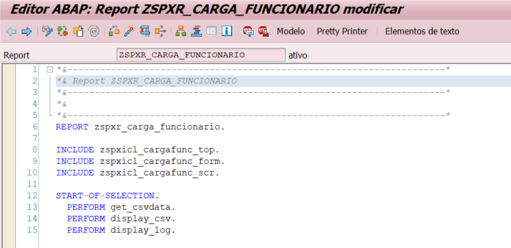
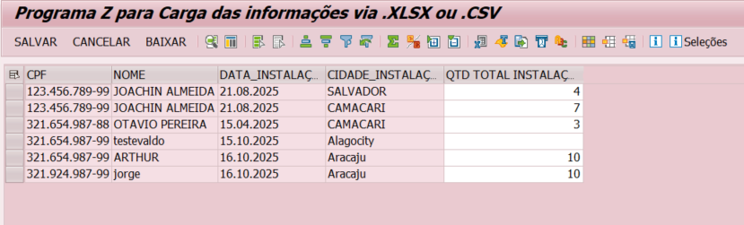
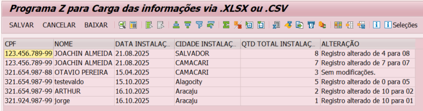

# Installation Data Loader (ABAP)

Este repositório contém um programa ABAP desenvolvido para carga de instalações a partir de arquivos CSV. O projeto foi criado com o objetivo de consolidar conhecimentos em ABAP Procedural, manipulação de arquivos e ALV.

## 📋 Funcionalidades

* **Leitura de CSV:** Importação de dados de instalações (Nome, Data, Cidade, Quantidade).
* **ALV Interativo:** Exibição dos dados importados com validações.
* **Gestão de Logs:** Exibição visual de alterações realizadas nos registros.
* **Status GUI Customizado:** Botões adicionais para "Salvar", "Cancelar" e "Baixar".

## 🛠️ Detalhes Técnicos

O desenvolvimento segue padrões de mercado, utilizando **Includes** e **Performs** para modularização do código.

### Estrutura do Código
A organização foi feita separando a lógica de seleção, formulários e declarações globais.

### Tela de Seleção e Eventos
Utilização de eventos `AT SELECTION-SCREEN` para validação e busca de arquivos no diretório local.

### Exibição de Dados (ALV)
O programa exibe os dados carregados em um ALV grid. Foi implementada lógica para exibição de logs de persistência e alterações.

**Visualização Inicial:**

**Visualização com Logs de Processamento:**

## 🚀 Próximos Passos e Evolução

Atualmente, o código está estruturado no paradigma procedural. O roadmap de evolução deste projeto inclui:

1.  **Refatoração para ABAP OO:** Reescrever a solução utilizando classes e métodos para melhor encapsulamento.
2.  **Estudos em RAP e Clean Core:** Compreender como adaptar essa lógica de carga para o modelo RESTful Application Programming (RAP).
3.  **Integração (CPI):** Analisar como fluxos de integração podem substituir a carga manual de arquivos para cenários automatizados.

---
*Desenvolvido por [Seu Nome]*